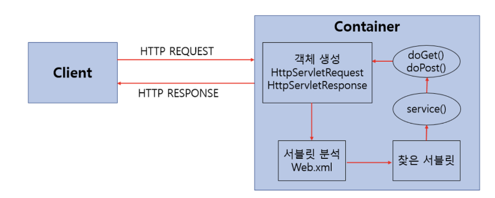

## Servlet (server + applet의 합성어)

- java 언어를 이용해 사용자 요청 받아 처리하고 결과를 다시 전송하는 class 파일을 servlet이라고 한다
- 웹에서 동적인 페이지를 java로 구현한 서버측 프로그램
- 모든 서블릿은 javax.servlet.Servlet 인터페이스 상속 받아 구현

### 특징

- 클라이언트 요청에 대해 동적으로 작동하는 웹 어플리케이션 컴포넌트
- html을 사용하여 응답
- java thread 이용 하여 동작
- MVC 패턴의 controller
- HTML 변경 시 servlet 재검파일 필요

### 동작방식

